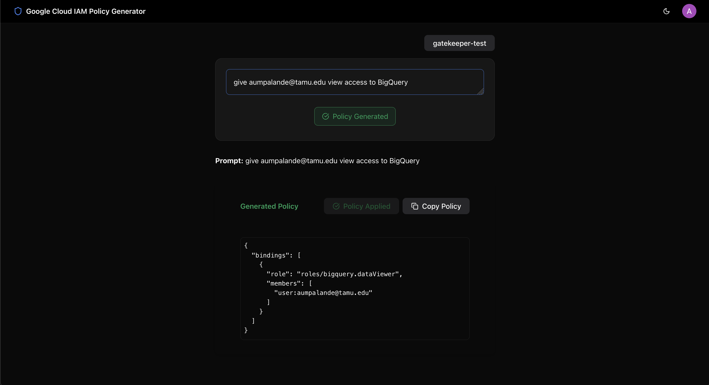

# Gatekeeper

---

## What is Gatekeeper?

**Gatekeeper** is an open-source tool designed to automate the creation of secure, accurate Google Cloud IAM (Identity and Access Management) policies using natural language prompts. Powered by advanced Large Language Models (LLMs), Gatekeeper simplifies complex IAM configurations, significantly reduces manual errors, and accelerates the deployment of secure cloud environments.

**Why Gatekeeper?**

Configuring IAM policies manually is error-prone, time-intensive, and often requires extensive familiarity with Google Cloud's intricate role system. Consider real-world scenarios:

>You're setting up a new CI/CD pipeline requiring comprehensive Cloud Storage and Pub/Sub access, alongside a specific Compute Engine permission.

**Prompt:** "Give my service account 'ci-service' permission to upload/manage artifacts in 'build-artifacts', publish messages to the 'deployments' Pub/Sub topic, and start/stop Compute Engine instances."

**Output:**
```
{
  "bindings": [
    {
      "role": "roles/storage.objectAdmin",
      "members": ["serviceAccount:ci-service@company.iam.gserviceaccount.com"]
    },
    {
      "role": "roles/pubsub.publisher",
      "members": ["serviceAccount:ci-service@company.iam.gserviceaccount.com"]
    },
    {
      "role": "roles/compute.instanceAdmin.v1",
      "members": ["serviceAccount:ci-service@company.iam.gserviceaccount.com"]
    }
  ]
}
```

With Gatekeeper, the above comprehensive policy can be immediately deployed to your Google Cloud project with just a single click, dramatically simplifying what would otherwise be a tedious manual process.

Gatekeeper outperforms direct LLM queries by employing a multi-stage verification pipeline, linting generated policies through the official [Google Cloud IAM Policy linting API](https://cloud.google.com/iam/docs/reference/rest/v1/iamPolicies/lintPolicy), heuristic validation, and a secondary verification model. These steps substantially reduce risks compared to directly applying raw LLM outputs.

---

## Technical Overview

Gatekeeper leverages modern, developer-friendly technologies and APIs for seamless development and extensibility:

- **Frontend:** React (Vite) with a responsive and modern interface that is easy to use, even for users with little to no experience creating IAM policies or using Google Cloud tools.
- **Backend:** Python (FastAPI) using llama-3.3-70b-versatile served by the [Groq API](https://console.groq.com/) for incredibly fast policy generation and verification.
- **Policy Verification:** Utilizes Google's native IAM Policy linting and custom heuristic methods to validate accuracy and security compliance before policy application.
- **Authentication and Deployment:** OAuth-based integration with Google Cloud APIs, providing users secure IAM policy deployment without having to enter the GCloud console a single time.

We chose to use llama-3.3-70b-versatile via Groq as the default model mainly due to its generous free tier, reliable performance, and impressive accuracy for IAM tasks. The Groq API endpoint also allows for significantly faster responses than any other leading providers, due to their use of the [LPU](https://groq.com/the-groq-lpu-explained/).

> Gatekeeper's architecture easily accommodates different LLM providers or models, making future model changes a rather trivial matter if the project were to be used in production or turned into a SaaS.

---

## Core Features

### Natural Language Policy Generation
- Describe IAM policy needs in plain English, Gatekeeper delivers precise IAM bindings.

### Advanced Verification Pipeline
- **Policy Linting:** Official [Google IAM linting endpoint](https://cloud.google.com/iam/docs/reference/rest/v1/iamPolicies/lintPolicy).
- **Heuristic Analysis:** Checks IAM policy correctness and security compliance.
- **Secondary Verification:** Additional automated model validation enhances confidence in deployments.

### Direct IAM Integration
- Instantly deploys verified policies directly into GCloud via the IAM API (user must be signed in with their Google account).

---

## Project Screenshots



---

# Getting Started

## 🐳 Running with Docker (recommended)

This project provides a Docker setup to run both the backend and frontend together in a single container.

---

### 1. Set Required Environment Variables

Before building or running the container, ensure you have the following API keys and credentials:

| Variable | Description |
|:---------|:------------|
| `GOOGLE_CLIENT_SECRET` | Obtain from [Google Cloud Console](#link) |
| `GOOGLE_CLIENT_ID` | Obtain from [Google Cloud Console](#link) |
| `GROQ_API_KEY` | Obtain from [Groq API Portal](#link) |
| `VITE_GOOGLE_OAUTH_CLIENT_ID` | Same as your `GOOGLE_CLIENT_ID` |

You will pass these in when running the container.

---

### 2. Build the Docker Image

```bash
docker build -t policies-llm-app .
```

### 3. Run the container
```bash
docker run -d \
  -p 8000:8000 \
  -p 4173:4173 \
  -e GOOGLE_CLIENT_SECRET="your-google-client-secret" \
  -e GOOGLE_CLIENT_ID="your-google-client-id" \
  -e GROQ_API_KEY="your-groq-api-key" \
  -e VITE_GOOGLE_OAUTH_CLIENT_ID="your-google-client-id" \
  --name policies-llm-app \
  policies-llm-app
```

### Local Development Setup

#### Backend
```bash
cd backend
python3 -m venv venv
source venv/bin/activate
pip install -r requirements.txt
uvicorn app.main:app --reload
```

#### Frontend
```bash
cd frontend
bun install
bun run start
```

---

## Known Issues

A detailed and current list of known issues and feature requests can be found on our [GitHub Issues page](https://github.com/aum1/gatekeeper/issues).

---

## Contributing

---

## Acknowledgements & Credits

**Gatekeeper** was proudly developed as a **Texas A&M University CSCE Senior Capstone Project (Spring 2025)**.

We extend heartfelt thanks to our hard-working mentors:
- **Nitin Mittal**, SWE Manager at Google, for invaluable guidance.
- **[Shreyas Kumar](https://engineering.tamu.edu/cse/profiles/kumar-shreyas.html)**, Professor of Practice, CSCE at Texas A&M University, for exceptional academic support.

### Project Team
- **Ahmad Raaiyan** *(Project Lead)*
- **Aum Palande** *(Technical Lead)*
- **David-Tyler Ighedosa** *(Developer)*
- **John-Carlos Breck Ortiz** *(Developer)*
